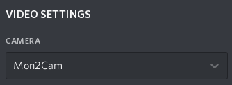

# Mon2Cam
Fix for multi-monitor Discord screensharing

Dependencies:
-
- xrandr
- ffmpeg
- v4l2loopback

Instructions:
-
- Install dependencies
- Download `Mon2Cam.sh`
- Run `chmod +x Mon2Cam.sh`
- Run `./Mon2Cam.sh`
- Follow prompt
- Switch discord webcam to "Mon2Cam" (Must be running)

Or use the [AUR package](https://aur.archlinux.org/packages/mon2cam-git/)

```
./Mon2Cam.sh - Monitor to Camera

./Mon2Cam.sh [option] [value]

options:
-h, --help                show help
-f, --framerate=FPS       set framerate
-d, --device-number=NUM   set device number
-m, --monitor-number=NUM  set monitor number
-vf, --vertical-flip      vertically flip the monitor capture
-hf, --horizontal-flip    horizontally flip the monitor capture
```

```
Monitors: 2
 0: +*DP-0 1920/531x1080/299+0+0  DP-0
 1: +HDMI-0 1366/410x768/230+1920+0  HDMI-0
Which monitor: 0
CTRL + C to stop
Your screen will look mirrored for you, not others
```



This is a continuation of [TaPO4eg3D/discord-monitors-to-vc](https://github.com/TaPO4eg3D/discord-monitors-to-vc) that uses pure bash instead of a mix of bash and python to remove the python dependency, it also adds dependency checking
