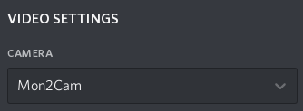
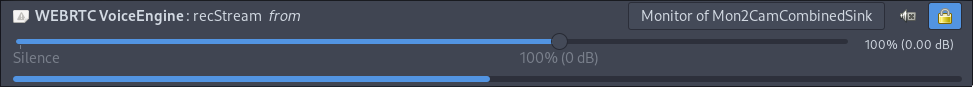

# Mon2Cam

Fix for multi-monitor Discord screensharing

## Dependencies:

- [Deno]
- [xrandr] (X11)
- [ffmpeg] (X11) or [wf-recorder] (wlroots)
- [v4l2loopback] 0.12+

Note:
Ubuntu 18.04 and below does not provide v4l2loopback 0.12, if you use older versions of Ubuntu you will need to [compile from source](https://github.com/umlaeute/v4l2loopback#install)

## Instructions:

- Install [Deno]  ***DO NOT USE UBUNTU SNAP***
- Run `curl -s https://raw.githubusercontent.com/ShayBox/Mon2Cam/master/install.sh | sh`
- Open a new terminal and type `mon2cam`
- Switch discord webcam

You can also use the [AUR] package which is a deno bundle and a desktop file

```
Mon2Cam - Monitor 2 Camera

Mon2Cam [options] [value]

options:
-h,  --help,       Show help
-f,  --framerate,  Set framerate
-d,  --device,     Set device number
-m,  --monitor,    Set monitor number
-r,  --resolution, Set output resolution (W:H)
-vf, --vflip,      Vertically flip the camera
-hf, --hflip,      Horizontally flip the camera
-b,  --border,     Add border when scaling to avoid stretching
-s,  --sound,      Create virtual sink and route sound into it
-v,  --verbose,    Show verbose output

To find out more, visit https://github.com/shaybox/mon2cam
```

```
0: 1920x1080
1: 1366x768
2: 1366x768
Which monitor?
0
INFO CTRL + C to stop
INFO The screen will look mirrored for you, not others
```



## Audio routing

There is audio routing built into Mon2Cam, which you can use with the -s flag. It's interactive, so it's not hard to use, but keep in mind that it may still have bugs. Also, it probably introduces some latency, however this wasn't tested and is probably quite tiny. (I haven't noticed any difference.)

Mon2Cam will try to detect if discord is trying to record, and then switch it's input to the Mon2Cam combined sink, but you may have to do it manually. You should also disable echo cancellation, because discord will detect most audio as echo.



[deno]: https://deno.land/
[xrandr]: https://www.x.org/releases/X11R7.7/doc/man/man1/xrandr.1.xhtml
[ffmpeg]: http://ffmpeg.org/
[v4l2loopback]: https://github.com/umlaeute/v4l2loopback
[aur]: https://aur.archlinux.org/packages/mon2cam-git/
[wf-recorder]: https://github.com/ammen99/wf-recorder
