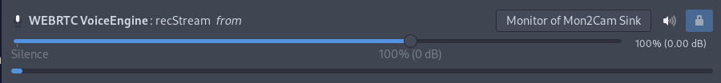

# Mon2Cam
Fix for multi-monitor Discord screensharing

Dependencies:
-
- wf-recorder (for Wayland support)
- xrandr
- ffmpeg
- v4l2loopback 0.12+

Note:
Ubuntu 18.04 and below does not provide v4l2loopback 0.12, if you use older versions of Ubuntu you will need to [compile from source](https://github.com/umlaeute/v4l2loopback#install)

Instructions:
-
- Install dependencies
- Download `Mon2Cam.sh`
- Run `chmod +x Mon2Cam.sh`
- Run `./Mon2Cam.sh`
- Follow prompt
- Switch discord webcam to "Mon2Cam" (Must be running)

Or use the [AUR package](https://aur.archlinux.org/packages/mon2cam-git/)

```
./Mon2Cam.sh - Monitor to Camera

./Mon2Cam.sh [options] [value]

options:
-h,  --help               show help
-f,  --framerate=FPS      set framerate
-d,  --device-number=NUM  set device number
-m,  --monitor-number=NUM set monitor number
-vf, --vertical-flip      vertically flip the monitor capture
-hf, --horizontal-flip    horizontally flip the monitor capture
-r,  --resolution W:H     manually set output resolution
-b,  --border             add border when scaling to avoid stretching
-s,  --sound              create virtual sink and route sound into it (requires pulseaudio)
-w,  --wayland            force support for Wayland sessions
-x,  --x11                force support for X11 sessions
```

```
Monitors: 3
 0: +*DP-0 1920/531x1080/299+1366+0  DP-0
 1: +DP-2 1366/410x768/230+3286+0  DP-2
 2: +HDMI-0 1366/410x768/230+0+0  HDMI-0
Which monitor: 0
CTRL + C to stop
Your screen will look mirrored for you, not others
```


Audio routing
-

There is a built in audio streaming feature, but it's quite **experimental**. It uses *pulseaudio* to route the audio of your microphone (or any other input) and the sound of any selected output(application) into a virtual sink which then you can select as an input in discord.

To use, pass the `-s` option, select the appropriate applications and sources (You have to pass a space separated list of ids, or a single id). Then, set the default recording device to be the VirtualSink Monitor and then instruct discord to record from the monitor of the VirtualSink. After this, you should disable noise cancellation and noise reduction in discord, to achieve a good quality stream. 

Also **note** that in the current implementation, if you use this feature, you won't be able to hear the selected application(s), only the people listening to the stream. You can workaround this by using a command like: `ffplay -f pulse -i default -nodisp` and then changing the recorded source in *pavucontrol*, however you will also hear any inputs that you might have passed (so if you passed your microphone, you will hear yourself).



Note
-
This is a continuation of [TaPO4eg3D/discord-monitors-to-vc](https://github.com/TaPO4eg3D/discord-monitors-to-vc) that uses pure bash instead of a mix of bash and python to remove the python dependency, it also adds dependency checking
